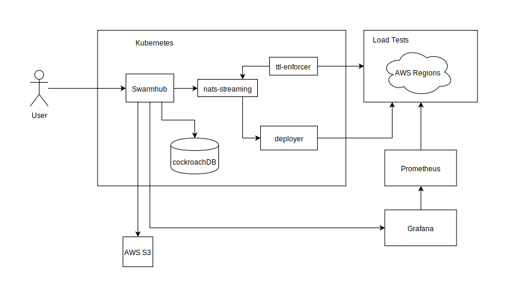
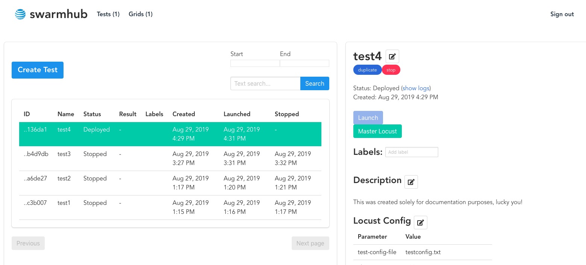

# Swarmhub
Swarmhub is a load testing portal to manage your locust load tests. It allows you to save, deploy, and manage load tests. Swarmhub is run inside kubernetes and currently supports deploying tests into AWS. Load tests can be monitored by prometheus and swarmhub can be configured to take a grafana snapshot of the timerange the load test was deployed.

## Architecture

The user hits swarmhub through a kubernetes ingress which takes them to the login page, the login can be configured for LDAP or if you are trying to get something running quickly local users. The local user password is saved hashed inside a kubernetes secret file. 
  
Once logged in you can go to the Grids tab in order to create a new deployment grid. The deployment grid consists of a Name, Provider, Region, Master Instance Type, Slave Instance Type, Number of Slave Nodes, and TTL. TTL is the time to live before the grid is automatically deleted by the ttl-enforcer. Once a Grid is created you can click deploy and it is sent to the deployer for it to be deployed. The deployer uses ansible to deploy the grid.

  
When you have a deployed grid you can now go to the Tests tab in order to run a load test. If you click Create Test you are prompted with the fields Name, Description, and Upload a test... button. To create a test you need to provide a zip file that contains locustfile.py in the base directory. Once you have created a test you can deploy it to a grid that doesn't have a test already deployed to it. 
  
Click on the test and then click on the Launch button. Pick the grid you would like to deploy to from the dropdown and deploy. The deploy command is sent to the deployer to provision the test onto the grid. When successfully deployed you should see a Master Locust appear. When you click that it will redirect you to the locust UI. When the load test is finished and you have grafana enabled, a grafana snapshot is taken using the launched and stopped timestamps of the test.

## Deployment
Please see [here](deployments/README.md) 
